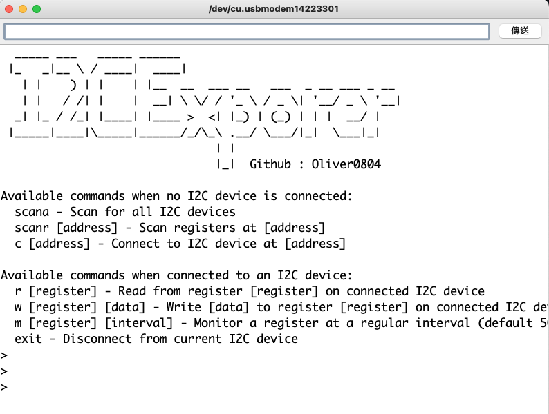

# i2cExplorer

## Introduction
i2cExplorer is a powerful tool designed for exploring I2C devices on the bus using the RP2040 as the MCU within the Arduino framework. It allows users to interact with I2C devices via a serial interface, providing capabilities for scanning, reading, and writing I2C registers.

## Features
- I2C Bus Scanning: Detect all I2C devices connected to the RP2040.
- Read I2C Registers: Read values from specified registers of the connected I2C devices.
- Write I2C Registers: Write data to specified registers of the connected I2C devices.
- Monitor I2C Registers: Continuously read and print values from a specific register at regular intervals.
- Serial Interface: Communicate with the RP2040 and I2C devices through a serial connection.
## Usage
### Command List
Execute the following commands through your serial terminal:

```
- `scana`: Scan all I2C devices on the bus.
- `scanr [address]`: Scan registers at the specified I2C address.
- `c [address]`: Connect to an I2C device at the given address.
- `r [register]`: Read from a register on the connected I2C device.
- `w [register] [data]`: Write data to a register on the connected I2C device.
- `m [register] [interval]`: Monitor a register at the specified interval (in milliseconds).
- `exit`: Disconnect from the current I2C device.
- `help`: Display available commands based on the connection status.
```

## Monitoring Interval
For the m command, the interval is optional (default is 500ms). The maximum allowed interval is 3000ms.

## Example

```
> scana
> c 0x68
> r 0x1
> w 0x1 0xFF
> m 0x1 1000
> exit
```


## Note
Ensure your RP2040 and I2C devices are correctly connected and configured.
This tool is intended for exploration and debugging purposes.
