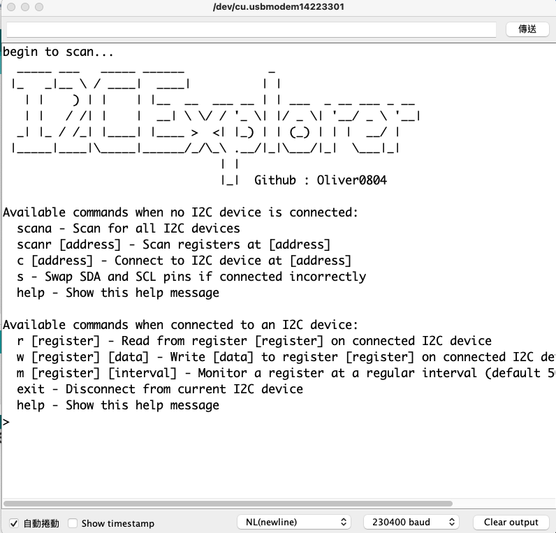
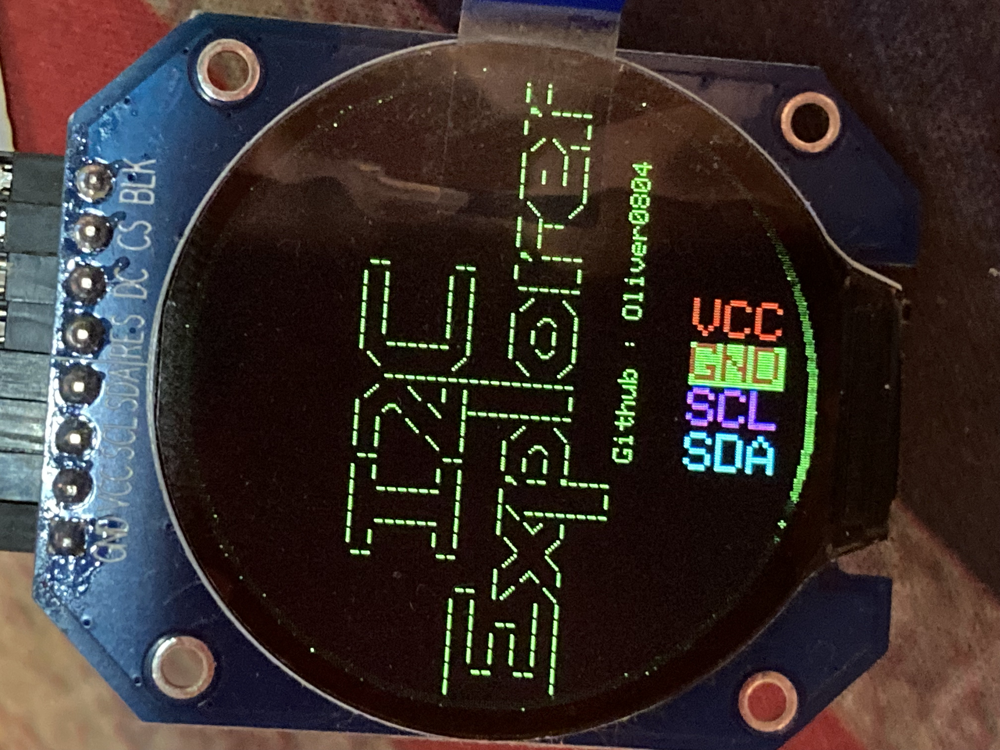

# i2cExplorer

## Introduction

https://www.youtube.com/watch?v=PAolOif3dD0&ab_channel=BashCat


i2cExplorer is a powerful tool designed for exploring I2C devices on the bus using the RP2040 as the MCU within the Arduino framework. It allows users to interact with I2C devices via a serial interface, providing capabilities for scanning, reading, and writing I2C registers.

『I2C Explorer』是一個非常實用的工具，特別適合於解決在使用I2C通訊協議時可能遇到的一些常見問題和場景。以下是幾個典型的使用場景，以及I2C Explorer如何幫助解決這些問題：
1. 不知道I2C裝置的地址：在開發I2C應用時，常常需要知道連接到I2C總線的裝置地址。如果文檔不清楚或者你正在使用未標記的硬件，I2C Explorer的掃描功能（scana命令）可以掃描總線上的所有裝置，幫助你快速找到每個裝置的地址。
2. 混淆了SDA和SCL線：有時可能會不小心將SDA（數據線）和SCL（時鐘線）接反。I2C Explorer提供了一個方便的命令（s命令），可以在不重新布線的情況下軟件層面上交換這兩條線，從而糾正連接錯誤。
3. 探索特定I2C裝置的寄存器：當你需要了解某個特定I2C裝置的內部寄存器結構時，I2C Explorer的寄存器掃描功能（scanr命令）可以讀取並顯示連接到指定地址的I2C裝置的所有寄存器信息。
4. 讀取或寫入I2C裝置的寄存器：在開發和調試階段，直接從串口讀取或寫入I2C裝置的寄存器是非常有用的。I2C Explorer通過提供讀取（r命令）和寫入（w命令）命令，使這一過程變得簡單快捷。

I2C Explorer is an extremely practical tool, particularly suited for addressing common problems and scenarios encountered when using the I2C communication protocol. Below are several typical use cases, and how the I2C Explorer helps in resolving these issues:
1. Unknown I2C Device Address: During the development of I2C applications, it's often necessary to know the addresses of devices connected to the I2C bus. If documentation is unclear or you are working with unmarked hardware, the scanning feature (scana command) of I2C Explorer can scan all devices on the bus, helping you quickly find the address of each device.
2. Confusion between SDA and SCL Lines: Sometimes, you might accidentally reverse the SDA (data line) and SCL (clock line). I2C Explorer offers a convenient command (s command) that swaps these two lines at the software level without the need for rewiring, thereby correcting the connection error.
3. Exploring the Registers of a Specific I2C Device: When you need to understand the internal register structure of a particular I2C device, the register scanning feature (scanr command) of I2C Explorer can read and display all the register information of the device connected to a specified address.
4. Reading or Writing to I2C Device Registers: During the development and debugging phases, directly reading from or writing to the registers of an I2C device through the serial port is very useful. I2C Explorer simplifies this process by providing commands for reading (r command) and writing (w command).

## Hardware Setup


Connect any I2C device to your RP2040, using the following pins:
- SDA (Serial Data Line): Connect to GP0 on the Pico.
- SCL (Serial Clock Line): Connect to GP1 on the Pico.
Ensure that your I2C devices are compatible with the RP2040's voltage levels and properly powered.

## Features
- I2C Bus Scanning: Detect all I2C devices connected to the RP2040.
- Read I2C Registers: Read values from specified registers of the connected I2C devices.
- Write I2C Registers: Write data to specified registers of the connected I2C devices.
- Monitor I2C Registers: Continuously read and print values from a specific register at regular intervals.
- Serial Interface: Communicate with the RP2040 and I2C devices through a serial connection.
- Swap I2C bus ( SDA & SCL )


## Usage
### Command List
Execute the following commands through your serial terminal:

```
- `scana`: Scan all I2C devices on the bus.
- `scanr [address]`: Scan registers at the specified I2C address.
- `c [address]`: Connect to an I2C device at the given address.
- `r [register]`: Read from a register on the connected I2C device.
- `w [register] [data]`: Write data to a register on the connected I2C device.
- `m [register] [interval]`: Monitor a register at the specified interval (in milliseconds).
- `exit`: Disconnect from the current I2C device.
- `help`: Display available commands based on the connection status.
```
#### scana

#### c 0x68 and r 0x75


## Monitoring Interval
For the m command, the interval is optional (default is 500ms). The maximum allowed interval is 3000ms.

## Example

```
> scana
> c 0x68
> r 0x1
> w 0x1 0xFF
> m 0x1 1000
> exit
```


## Note
Ensure your RP2040 and I2C devices are correctly connected and configured.
This tool is intended for exploration and debugging purposes.
